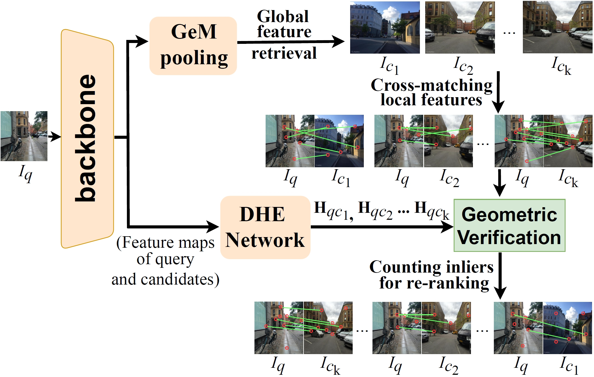

# DHE-VPR
This is the official repository for the AAAI 2024 paper "Deep Homography Estimation for Visual Place Recognition".
[[AAAI proceedings](https://ojs.aaai.org/index.php/AAAI/article/view/28901)] [[arXiv](https://arxiv.org/pdf/2402.16086.pdf)] The arXiv version is more complete.



**Our another two-stage VPR work SelaVPR achieved SOTA performance on several datasets. The code has been released [HERE](https://github.com/Lu-Feng/SelaVPR).**

## Getting Started

This repo follows the [Visual Geo-localization Benchmark](https://github.com/gmberton/deep-visual-geo-localization-benchmark). You can refer to it ([VPR-datasets-downloader](https://github.com/gmberton/VPR-datasets-downloader)) to prepare datasets and train the CCT-14 backbone (i.e. feature extractor).

The dataset should be organized in a directory tree as such:

```
├── datasets_vg
    └── datasets
        └── pitts30k
            └── images
                ├── train
                │   ├── database
                │   └── queries
                ├── val
                │   ├── database
                │   └── queries
                └── test
                    ├── database
                    └── queries
```

You can directly download the trained CCT-14 backbone:

trained on MSLS: [CCT14_msls](https://drive.google.com/file/d/1kXGixMjU_imBu0Yq5cZVovBUx3MGyoZ8/view?usp=sharing)

trained on Pitts30k: [CCT14_pitts30k](https://drive.google.com/file/d/1CBrM9GwJeVgiGfNZVgBVLRoh3Jw5ZoWB/view?usp=sharing)

## Train (initialize) the DHE network

After getting the CCT14 backbone  trained on MSLS (CCT14_msls.pth), you can train (i.e. initialize) the DHE network on MSLS:

```
python train_dhe.py --resume_fe=/path/to/your/CCT14_msls.pth --datasets_folder=/path/to/your/datasets_vg/datasets --dataset_name=msls
```

You can directly download the initialized DHE network [HERE](https://drive.google.com/file/d/19TlUo7pkXweLIW0kzbaf7YVNofx50xQW/view?usp=sharing).

## Finetune

To jointly finetune the backbone and the DHE network on the MSLS dataset, please run:

```
python3 finetune.py --datasets_folder=/path/to/your/datasets_vg/datasets --dataset_name=msls --epochs_num=2 --resume_fe=/path/to/your/CCT14_msls.pth --resume_hr=/path/to/your/initializedDHE.torch --queries_per_epoch=10000
```

Finetune on the Pitts30k dataset, please run:

```
python3 finetune.py --datasets_folder=/path/to/your/datasets_vg/datasets --dataset_name=pitts30k --epochs_num=40 --resume_fe=/path/to/your/CCT14_pitts30k.pth --resume_hr=/path/to/your/initializedDHE.torch
```

You can directly download the finetuned CCT14 backbone and DHE network:

MSLS:  [finetunedCCT14](https://drive.google.com/file/d/1Fs-cc4lPn5XjfP_eVGUG8bQg7ZKZP88S/view?usp=sharing)  | [finetunedDHE](https://drive.google.com/file/d/1Ec2fCAd4c3jhzOXNuqKUkavUQ7eFCGxQ/view?usp=sharing)

Pitts30k:  [finetunedCCT14](https://drive.google.com/file/d/1GpjiNHn8ceMK8J3AyEhxbUIuDKlqJFQI/view?usp=sharing)  | [finetunedDHE](https://drive.google.com/file/d/1-8_14BG4uBr3X2zvHLlsoB3RYn8to3C3/view?usp=sharing)

## Test

To evaluate the finetuned complete DHE-VPR model on MSLS (or Pitts30k), run:

```
python eval.py  --resume_fe=/path/to/your/finetunedCCT14_msls.torch --resume_hr=/path/to/your/finetunedDHE_msls.torch --datasets_folder=/path/to/your/datasets_vg/datasets --dataset_name=msls
```

## Acknowledgements

Parts of this repo are inspired by the following repositories:

[Visual Geo-localization Benchmark](https://github.com/gmberton/deep-visual-geo-localization-benchmark)

[GeoWarp](https://github.com/gmberton/geo_warp)

[TransVPR](https://github.com/RuotongWANG/TransVPR-model-implementation)

## Citation

If you find this repo useful for your research, please consider citing the paper

```
@inproceedings{dhevpr,
  title={Deep Homography Estimation for Visual Place Recognition},
  author={Lu, Feng and Dong, Shuting and Zhang, Lijun and Liu, Bingxi and Lan, Xiangyuan and Jiang, Dongmei and Yuan, Chun},
  booktitle={Proceedings of the AAAI Conference on Artificial Intelligence},
  year={2024},
  volume={38}, 
  number={9}, 
  pages={10341-10349}
}
```
